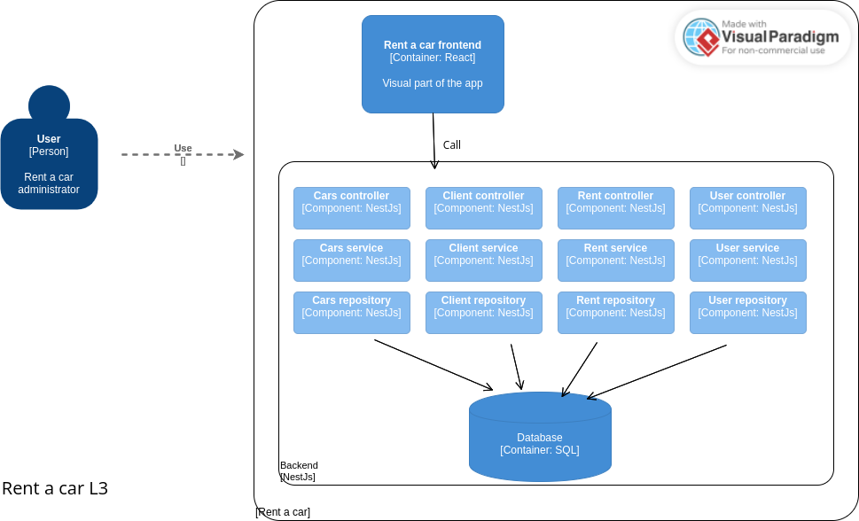

# Rent-a-car-frontend

C4 Diagrams. Levels 1, 2 and 3.





Frontend of the rent a car project. Made with React and tested with Cypress.

## Usage
First all: Create the .env file and set the environment variables of the .env.dist file and add the values to it.


After this, while running the backend:
```bash
npm install && npm run dev
``` 

### Testing
For run testing, in backend run: 

```bash
npm run start:test
``` 

and in frontend run:

```bash
npm run cypress:open
``` 